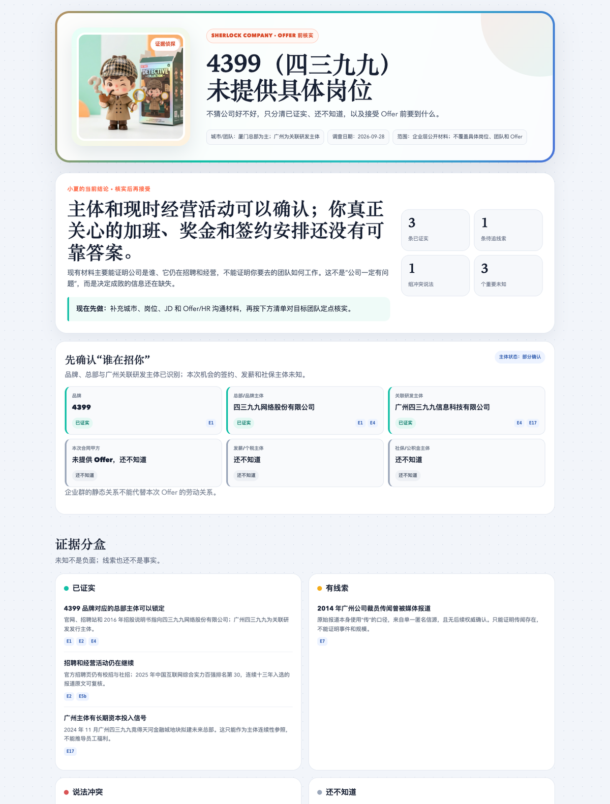
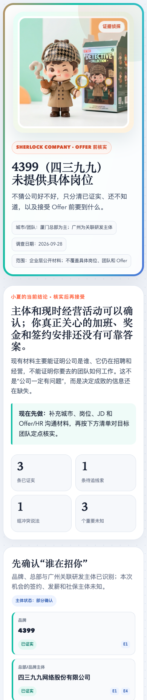

# Sherlock Company

**Offer 前的公司证据调查助手。** 输入公司、岗位、城市和你最关心的问题，它会把网上的各种说法整理成四种状态——已证实 / 有线索 / 说法冲突 / 还不知道——并给你一份接受 Offer 前的核实清单，和一份可以离线打开的 HTML「侦探档案」。

它不猜一家公司「好不好」，只回答三件事：哪些事已经证实、哪些还不知道、接受前应该核实什么。

## 报告长什么样

| 桌面版 | 手机版 |
| :---: | :---: |
|  |  |

这是 4399 案例报告的开屏部分（结论、主体识别、证据分类）。完整报告和证据链在 [cases/4399/](./cases/4399/)，浏览器直接打开 HTML 即可，不需要网络。

## 它怎么工作

1. **先锁定签约主体。** 品牌 ≠ 签约公司：「字节跳动」的劳动合同甲方可能是集团内任何一家子公司。主体没确认前，不下公司结论。
2. **公开检索，建立证据账本。** 每条材料记录来源、日期、适用主体，以及它能证明什么、不能证明什么。搜索摘要、聚合站和匿名帖只算线索，必须追到原文才算数。
3. **每条断言只落四种状态。** 已证实 / 有线索 / 说法冲突 / 还不知道。「页面被拦截」「搜到 0 条」是检索状态，不是「不存在问题」。
4. **主动找反证。** 对每个关键疑点写「观察 → 假设 → 支持与反证 → 当前判断」，负面材料分清匿名指控、进行中争议和已确认结果。
5. **产出报告。** 一句话结论、逐条关切卡片（已知 / 未知 / 影响 / 下一步）、可复制给招聘人员的核实问题清单，以及离线 HTML 档案。

## 快速开始

### 方式一：安装 Skill（本地智能体）

把 `skill/sherlock-company` 复制到智能体的技能目录（以 Codex 为例）：

```bash
mkdir -p "${CODEX_HOME:-$HOME/.codex}/skills/sherlock-company"
cp -R skill/sherlock-company/. "${CODEX_HOME:-$HOME/.codex}/skills/sherlock-company/"
```

重启或重新加载智能体后：

```text
使用 $sherlock-company 调查「公司 + 岗位 + 城市」。我最关心加班、试用期、奖金和签约主体。
```

Skill 需要智能体具备联网搜索和文件读写能力；生成 HTML 报告需要本机有 Python 3。

### 方式二：不装任何东西

把 [PROMPT.md](./PROMPT.md) 里的通用 Prompt 复制给任意联网 AI，填入公司、岗位、城市和你的关切。它会按同样的规则产出文字报告，不依赖本仓库的脚本。

## 样例案例

仓库里带三个只用公开信息跑出来的实测样例：

| 案例 | 输入 | 报告 |
| --- | --- | --- |
| 4399 | `4399` | [report-v5.html](./cases/4399/report-v5.html)，含完整证据链（输入、主体关系、来源登记、证据账本、反证、复评） |
| 字节跳动 | `字节跳动 后端开发 北京` | [report.html](./cases/bytedance-backend-bj/report.html) |
| 拼多多 | `拼多多 后端开发 上海` | [report.html](./cases/pdd-backend-sh/report.html) |

三个案例的结论都落在四档状态之一（如「核实后再接受」），不自动生成星级或百分比评分。

## 企查查（可选）

Skill 默认只用公开网络检索。如果你配置了[企查查智能体数据平台](https://agent.qcc.com/)的官方 MCP 或 CLI，它会用企查查核对法律主体、工商、股东、经营风险和司法记录；出现多个候选主体时会先请你确认，而不是替你猜：

```bash
npm install -g qcc-agent-cli
qcc init --authorization "Bearer YOUR_API_KEY"
```

API Key 在平台右上角头像 →「获取我的 API KEY」申请。密钥不要写进命令行参数、截图或提交记录；官方服务协议要求账号与数据在中国大陆境内使用。接入方式、积分计费和权限边界见 [research/qcc-official.md](./research/qcc-official.md)。

## 生成 HTML 报告

调查结束后，Skill 会把结构化案件记录渲染成自包含的离线 HTML——侦探形象已内嵌，打开不需要 CDN、字体或 JavaScript：

```bash
python3 skill/sherlock-company/scripts/render_report.py \
  cases/4399/decision-report.json \
  --output cases/4399/report-v5.html
```

JSON 格式见 [case-schema.md](./skill/sherlock-company/references/case-schema.md)。渲染器会转义外部文字、拒绝不安全协议链接、扫描个人联系方式，未完成隐私复核的案件会被拒绝渲染。

## 开发者：测试与视觉验收

```bash
python3 -m unittest discover -s tests -v   # 18 项渲染逻辑与安全测试
npm install --no-save playwright           # 可选：离线渲染视觉回归
node tests/verify_generated_html.mjs       # 缺省回归 4399，可传其它案例目录名
```

报告视觉风格的三版迭代样张见 [index.html](./index.html)（选版中心）及 version1–3 三个页面，仅作视觉参考，不是可执行模板。

## 边界与限制

- 结论默认只在「可以继续聊 / 核实后再接受 / 已足够决定 / 先不接受」中选一个，紧跟证据理由；不生成星级或「信息完整度 xx%」，除非你明确要求并定义了评分模型。
- 员工体验拿不到时，报告会如实写缺口和补证路线，不编造体验评分或样本量。
- 不做账号池、反爬绕过或评价平台爬虫，纯公开搜索有时间上限。
- 分析你的职位说明、录用通知或聊天记录前，会先要求脱敏（手机号、证件号、银行卡、签名等）；未获明确授权不会把这些材料发给外部服务。
- 已验证环境：Apple M1 Mac、Python 3、Chrome/Playwright；企查查 MCP 完成过握手与一次真实主体识别。其它环境未实测。

## 作者

作者全平台同名：**欧八同学**。

- 个人主页 / 联系我：[albertou.redboook.cn](https://albertou.redboook.cn/)
- 微信公众号：扫码关注
- 抖音：[搜索“欧八同学”](https://www.douyin.com/search/%E6%AC%A7%E5%85%AB%E5%90%8C%E5%AD%A6)
- 小红书：[搜索“欧八同学”](https://www.xiaohongshu.com/search_result?keyword=%E6%AC%A7%E5%85%AB%E5%90%8C%E5%AD%A6)
- X：[搜索“欧八同学”](https://x.com/search?q=%E6%AC%A7%E5%85%AB%E5%90%8C%E5%AD%A6&src=typed_query)

<p align="center">
  
</p>

如果这个项目对你有用，欢迎点个 Star。遇到问题时，提交命令、报错和最小复现步骤就够了；请不要上传真实私人照片。

## 许可证

[MIT](./LICENSE)。仓库中的侦探形象为 AI 生成的原创虚构形象；调查方法借鉴了 [sherlock-project/Sherlock](https://github.com/sherlock-project/Sherlock)（MIT）的工程思路，未复制其代码。
